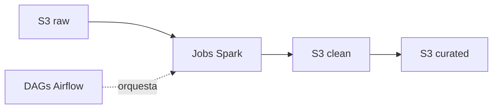

<h1 align="center">VoltaGrid Data</h1>

<p align="center">
  <a href="README.es.md">🇪🇸 Español</a> | <a href="README.md">🇺🇸 English</a>
</p>

<p align="center">
  <a href="https://spark.apache.org/"></a>
  <a href="https://airflow.apache.org/"></a>
  <a href="https://aws.amazon.com/s3/"></a>
</p>

---

<p align="center">
  Jobs Spark + DAGs de Airflow para VoltaGrid: limpieza, deduplicación, estimación de huecos, franjas tarifarias, pérdidas por transformador y liquidación de eventos sobre S3 raw/clean/curated.
</p>

## Tabla de Contenido

- [Qué es / qué no es](#qué-es--qué-no-es)
- [Arquitectura](#arquitectura)
- [Estructura](#estructura)
- [Inicio Rápido](#inicio-rápido)
- [Testing](#testing)
- [Equipo](#equipo)
- [Documentación](#documentación)
- [Contribuir](#contribuir)

## Qué es / qué no es

<!-- TODO (P2): 5 líneas máx. Qué corre aquí (jobs Spark, DAGs, RN-01..RN-10). Qué NO corre aquí (API→voltiagrid-api, Power BI→voltiagrid-analytics). -->

## Arquitectura

<!-- TODO (P2+P3): mini-diagrama: S3 raw → Spark → S3 clean → S3 curated, orquestado por Airflow. Marcar frecuencia: 30min / diario <45min. -->



## Estructura

<!-- TODO: ajustar a las carpetas reales cuando existan. -->

```
voltiagrid-data/
├── jobs/           # jobs PySpark (clean, dedup, estimate, bands, losses, events)
├── dags/           # DAGs Airflow (30min, cierre diario, carga histórica)
├── tests/          # tests unitarios + checks de calidad
├── docs/
│   ├── CONTRIBUTING.md
│   └── CONTRIBUTING.es.md
├── README.md
└── README.es.md
```

## Inicio Rápido

<!-- TODO: corrida <30min. Esqueleto — reemplazar con comandos reales. -->

```bash
# TODO: comando conda/venv o docker
# TODO: ejemplo spark-submit con --mode dev
# TODO: cómo disparar un DAG local
```

## Testing

<!-- TODO: comando pytest + al menos un test por regla RN-01..RN-10. -->

```bash
# TODO: pytest tests/ -v
```

| Test | Regla | Qué verifica |
|---|---|---|
| <!-- TODO --> | RN-02 | <!-- TODO: dedup por secuencia --> |

## Equipo

| Rol | GitHub |
|---|---|
| P2 — Ingeniería de datos (owner) | <!-- TODO: nombre + @github --> |
| P3 — Soporte Airflow/AWS | <!-- TODO: nombre + @github --> |

## Documentación

Arquitectura completa, ADRs y costos: `voltiagrid-docs` (P4). API que sirve estos resultados: `voltiagrid-api`.

| Idioma | Este repo | Spec completa |
|---|---|---|
| Español | Este README | `voltiagrid-docs` |
| Inglés | [README.md](README.md) | `voltiagrid-docs` |

## Contribuir

Ver [CONTRIBUTING.es.md](docs/CONTRIBUTING.es.md) (copiar desde `voltiagrid-api/docs/` — mismo flujo de ramas/commits/PRs).
