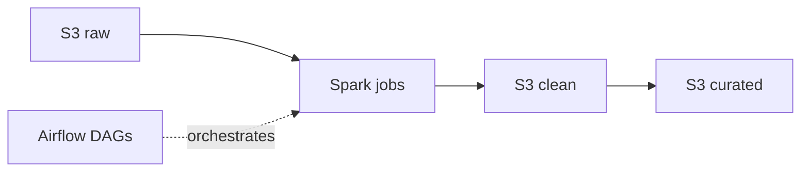

<h1 align="center">VoltaGrid Data</h1>

<p align="center">
  <a href="README.es.md">🇪🇸 Español</a> | <a href="README.md">🇺🇸 English</a>
</p>

<p align="center">
  <a href="https://spark.apache.org/"></a>
  <a href="https://airflow.apache.org/"></a>
  <a href="https://aws.amazon.com/s3/"></a>
</p>

---

<p align="center">
  Spark jobs + Airflow DAGs for VoltaGrid: cleaning, deduplication, gap estimation, tariff bands, transformer losses and event settlement over S3 raw/clean/curated.
</p>

## Table of Contents

- [What it is / is not](#what-it-is--is-not)
- [Architecture](#architecture)
- [Structure](#structure)
- [Quick Start](#quick-start)
- [Testing](#testing)
- [Team](#team)
- [Documentation](#documentation)
- [Contributing](#contributing)

## What it is / is not

<!-- TODO (P2): 5 lines max. What runs here (Spark jobs, DAGs, RN-01..RN-10). What does NOT run here (API→voltiagrid-api, Power BI→voltiagrid-analytics). -->

## Architecture

<!-- TODO (P2+P3): paste mini-diagram: S3 raw → Spark → S3 clean → S3 curated, orchestrated by Airflow. Mark batch frequency: 30min / daily <45min. -->



## Structure

<!-- TODO: adjust to the real folders once created. -->

```
voltiagrid-data/
├── jobs/           # PySpark jobs (clean, dedup, estimate, bands, losses, events)
├── dags/           # Airflow DAGs (30min, daily close, historical load)
├── tests/          # job unit tests + data-quality checks
├── docs/
│   ├── CONTRIBUTING.md
│   └── CONTRIBUTING.es.md
├── README.md
└── README.es.md
```

## Quick Start

<!-- TODO: the <30min run. Example skeleton — replace with real commands. -->

```bash
# TODO: conda/venv or docker command
# TODO: spark-submit example with --mode dev
# TODO: how to trigger one DAG run locally
```

## Testing

<!-- TODO: pytest command + at least one test per business rule RN-01..RN-10. -->

```bash
# TODO: pytest tests/ -v
```

| Test | Rule | What it verifies |
|---|---|---|
| <!-- TODO --> | RN-02 | <!-- TODO: dedup by sequence --> |

## Team

| Role | GitHub |
|---|---|
| P2 — Data engineering (owner) | <!-- TODO: name + @github --> |
| P3 — Airflow/AWS support | <!-- TODO: name + @github --> |

## Documentation

Full architecture, ADRs and costs: `voltiagrid-docs` (P4). API serving these results: `voltiagrid-api`.

| Language | This repo | Full spec |
|---|---|---|
| English | This README | `voltiagrid-docs` |
| Spanish | [README.es.md](README.es.md) | `voltiagrid-docs` |

## Contributing

See [CONTRIBUTING.md](docs/CONTRIBUTING.md) (copy from `voltiagrid-api/docs/CONTRIBUTING.md` — same branch/commit/PR workflow).
